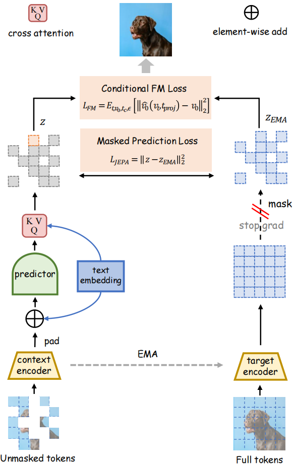

# JEPA-T: Joint-Embedding Predictive Architecture with Text Fusion for Image Generation<br>

This is the official repository for the paper:
> **JEPA-T: Joint-Embedding Predictive Architecture with Text Fusion for Image Generation**
>
> Siheng Wang\*<sup>†</sup>, Zhengdao Li\*, Yanshu Li, Canran Xiao, Haibo Zhan, Zhengtao Yao, Xuzhi Zhang,  Jiale Kang,  Linshan Li,  Weiming Liu,  Zhikang Dong,  Jifeng Shen<sup>#</sup>,  Piotr Koniusz <sup>#</sup>
>
> \*Equal contribution. <sup>†</sup>Project lead. <sup>#</sup>Corresponding author.
>


---

# 👋 Introduction

Modern Text-to-Image (T2I) generation increasingly relies on token-centric architectures that are trained with self-supervision, yet effectively fusing text with visual tokens remains a challenge. We propose \textbf{JEPA-T}, a unified multimodal framework that encodes images and captions into discrete visual and textual tokens, processed by a joint-embedding predictive Transformer. To enhance fusion, we incorporate cross-attention after the feature predictor for conditional denoising while maintaining a task-agnostic backbone. Additionally, raw texts embeddings are injected prior to the flow matching loss to improve alignment during training. During inference, the same network performs both class-conditional and free-text image generation by iteratively denoising visual tokens conditioned on text. Evaluations on ImageNet-1K demonstrate that JEPA-T achieves strong data efficiency, open-vocabulary generalization, and consistently outperforms non-fusion and late-fusion baselines. Our approach shows that late architectural fusion combined with objective-level alignment offers an effective balance between conditioning strength and backbone generality in token-based T2I.




## TODO List

- [x] Upload our paper to arXiv and build project pages.
- [x] Upload the code.
- [ ] Release JEPA-T model.

# 🤗 Prerequisite
<details> 
<summary>details</summary>
  
## Environment
```bash
conda create -n JEPA-T python=3.10 -y
pip install torch==2.1.2 torchvision==0.16.2 torchaudio==2.1.2
pip install -r requirements.txt
conda activate JEPA-T
```
We tested our environment on A100, H20 and 4090.


### Scripts
1.Cache VAE latents:
```bash
bash scripts/cache_vae.sh
```
2.Train/Evaluate JEPA-T:
```bash
bash scripts/jepat_base/large/huge.sh
```

# 👍 Acknowlegements
We sincerely thank the open-sourcing of these works where our code is based on [MAR](https://github.com/LTH14/mar.git)

We thank [Zelin Zang](zangzelin@gmail.com) for helpful discussion.


## 🔒 License
This code is distributed under an [CC BY-NC-SA 4.0](https://creativecommons.org/licenses/by-nc-sa/4.0/deed.en).

Note that our code depends on other libraries, including CLIP, MMDetection, and uses datasets that each have their own respective licenses that must also be followed.

